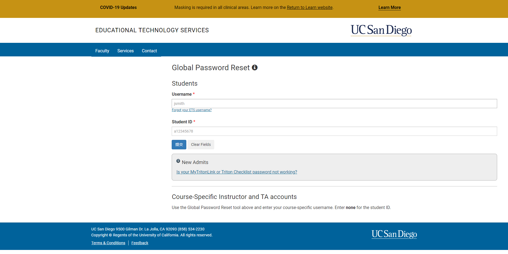
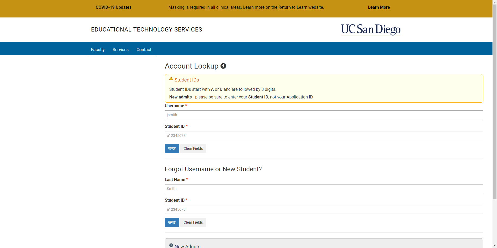

# Week 1 Lab Report
For future me...

## Installing VScode (Windows)
Installing Vscode on Windows is similar to installing most of the other software on Windows ---- straight forward and easy.
1. Download [VScode installer](https://go.microsoft.com/fwlink/?LinkID=534107)
2. Run the installer
3. Done!

## Installing VScode (Ubuntu)
Installing VScode on Ubuntu is pretty similar.
1. Download [VScode](https://code.visualstudio.com/sha/download?build=stable&os=linux-deb-x64)
2. Modern Ubuntu supports installing <font face='Courier New'>deb</font> files with the help of GUI. All what you want to do is to right click it and choose <font face='Courier New'>Open with software install</font>
3. Alternatively, using command line should always be your choice, just run
```
sudo apt install /path/to/deb_file
```

## Installing VScode (MacOS)
1. Download [VScode](https://go.microsoft.com/fwlink/?LinkID=534106)
2. Unlike other operation systems, all what you need to do is to drag your <font face='Courier New'>.app</font> file to **Application** folder.
3. Done!

## After Installation
If everything goes on right, run VScode and you should be able to see something like this (except for that girl):


## Connect to remote machine
### Changing password
If you are, and most likely you are, first time using your account, you need to reset your password so that everything will work. To reset your password, visit [this website](https://sdacs.ucsd.edu/~icc/password.php).<br>

Most likely you will need to first use **Forgot Username or New Student** [here](https://sdacs.ucsd.edu/~icc/index.php) to find your account (*you are not using your regular user name*) and then change your password. <br>

However, the website may change in the future so plz contact IT service for help if you cannot manage to reset your password.

### Remote connection
For CSE15L, we are using SSH to connect to remote servers. However, please be aware that there are multiple different ways to connect to remote servers.<br>
To connect to remote servers, in your terminal (or command line) run:
```
ssh your_user_name@remote_server_url
```
For the course I'm taking, the remote server URL is:
```
ieng6.ucsd.edu
```
Follow instructions on the screen to establish connection. You should be able to see something like this if you success:


## Try some command
### The Actual Best Way to Get Familiar with A Linux Command
In Linux, we have command <font face='Courier New'>man</font> which can print a full explanation of given command. If you forget the meaning/usage of one command, there you go :)
```
man linux_command
```
### <font face='Courier New'>**dir**</font>
This command will print all files and directories under current working directory or given directory.<br>
It's actually a command from Windows (actually MS-DOS). In linux, we usually use <font face='Courier New'>ls</font> instead of <font face='Courier New'>dir</font>.
```
dir
dir /path/to/given/directory
```
### <font face='Courier New'>**cd**</font>
This command will change current working directory
```
cd target_directory
```
### <font face='Courier New'>**mkdir**</font>
This command will generate a new directory under current working directory.
```
mkdir new_directory
```
### <font face='Courier New'>**echo**</font>
This command will print something on the screen or output the given string into a file.
```
echo your_words
echo your_words > your_file_to_overwrite
echo your_words >> your_file_to_append
```
### <font face='Courier New'>**cat**</font>
This command will print the content of a file on the screen.
```
cat your_file
```

