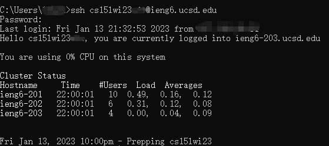

# Week 1 Lab Report
For future me...

## Installing VScode (Windows)
Installing Vscode on Windows is similar to installing most of the other software on Windows ---- straight forward and easy.
1. Download [VScode installer](https://go.microsoft.com/fwlink/?LinkID=534107)
2. Run the installer
3. Done!

## Installing VScode (Ubuntu)
Installing VScode on Ubuntu is pretty similar.
1. Download [VScode](https://code.visualstudio.com/sha/download?build=stable&os=linux-deb-x64)
2. Modern Ubuntu supports installing <font face='Courier New'>deb</font> files with the help of GUI. All what you want to do is to right click it and choose <font face='Courier New'>Open with software install</font>
3. Alternatively, using command line should always be your choice, just run
```
sudo apt install /path/to/deb_file
```

## After Installation
If everything goes on right, run VScode and you should be able to see something like this (except for that girl):


## Connect to remote machine
### Changing password
If you are, and most likely you are, first time using your account, you need to reset your password so that everything will work. To reset your password, visit [this website](https://sdacs.ucsd.edu/~icc/index.php).<br>
However, it may change in the future so plz contact IT service for help if you cannot manage to reset your password.

### Remote connection
For CSE15L, we are using SSH to connect to remote servers. However, please be aware that there are multiple different ways to connect to remote servers.<br>
To connect to remote servers, in your terminal (or command line) run:
```
ssh your_user_name@remote_server_url
```
For the course I'm taking, the remote server URL is:
```
ieng6@ucsd.edu
```
Follow instructions on the screen to establish connection. You should be able to see something like this if you success:


## Try some command
Well, nothing to say here to be honest...
