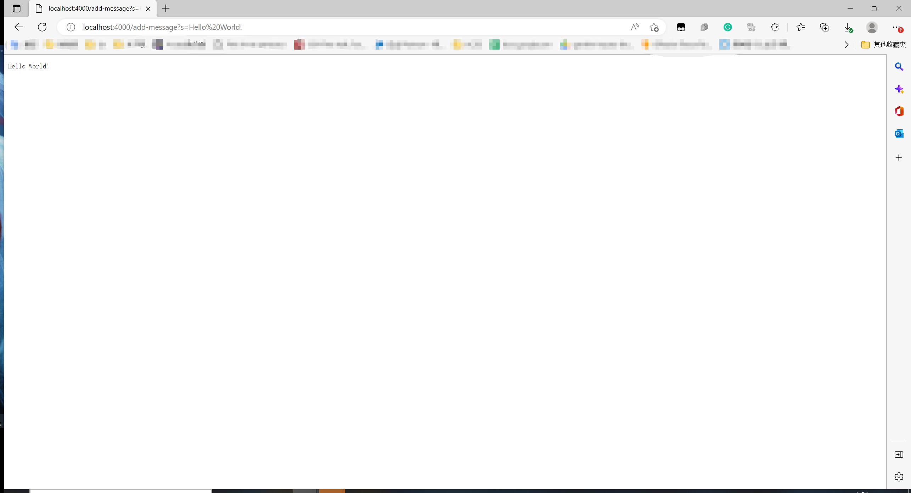
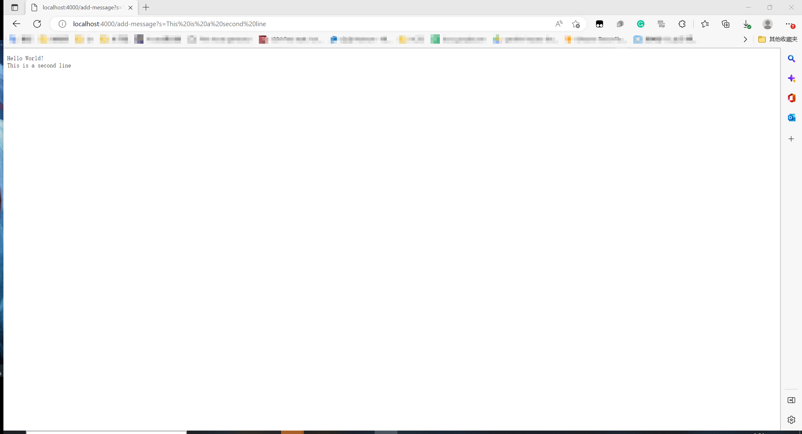
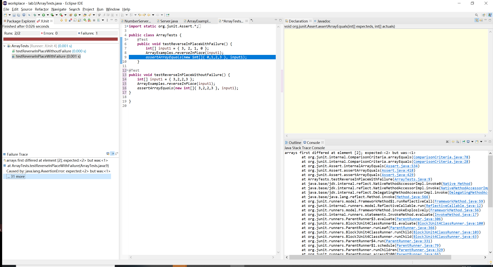

# Week 2 Lab Report

## **Part 1**
### Code for my <font face='Courier New'>StringServer</font>
```
import java.io.IOException;
import java.net.URI;

public class StringServer{
    
	private static boolean test = false;
	
    /**
     * Inner class for URI handler
     */
    static class Handler implements URLHandler{

        StringBuilder strToDisplay;

        public Handler(){
            strToDisplay = new StringBuilder();
        }

        public String handleRequest(URI url){
            String path = url.getPath();

            if(path.indexOf("add-message")==1){
                //should be an add command
                String strToBeAdded = url.getQuery();

                if(strToBeAdded.startsWith("s=")){
                    strToDisplay.append(strToBeAdded.substring(2));
                    strToDisplay.append("\n");
                    return strToDisplay.toString();
                }
            }
            return "404 Not Found";  
        }
    }

    public static void main(String... args) throws IOException{
    	
    	int port = -1;
    	
    	if(test) {
    		port = 4000;
    	}
    	else {
	        if(args.length == 0){
	            System.out.println("Missing port number!"+
                                   "Try any number between 1024 to 49151");
	            return;
	        }
	        
	        port = Integer.parseInt(args[0]);
    	}

        Server.start(port, new Handler());
    }
}
```
### **Screenshot 1**

Which method in my code are called?
 - ```handleRequest()``` defined by ```Handler```

Relevant arguments/fields and changes
 - ```Handler.strToDisplay```
   - Field varaible
   - Type = StringBuilder
   - Value:
     - Before: ""
     - After: "Hello World!\n"
 - ```url```
   - Method parameter
   - Type = URL
   - Value: /add-message?s=Hello%20World!

### **Screenshot 2**

Which method in my code are called?
 - ```handleRequest()``` defined by ```Handler```

Relevant arguments/fields and changes
 - ```Handler.strToDisplay```
   - Field varaible
   - Type = StringBuilder
   - Value:
     - Before: "Hello World!\n"
     - After: "Hello World!\nThis is a second line\n"
 - ```url```
   - Method parameter
   - Type = URL
   - Value: /add-message?s=This%20is%20a%20second%20line

## **Part 2**
- A failure-including input:
  ```
  @Test 
  public void testReverseInPlaceWithFailure() {
      int[] input1 = { 3, 2, 1, 0 };
	  ArrayExamples.reverseInPlace(input1);
	  assertArrayEquals(new int[]{ 0,1,2,3 }, input1);
  }
  ```
- A failure-excluding input:
  ```
  @Test 
  public void testReverseInPlaceWithoutFailure() {
      int[] input1 = { 3,2,2,3 };
      ArrayExamples.reverseInPlace(input1);
      assertArrayEquals(new int[]{ 3,2,2,3 }, input1);
  }
  ```
- The symptom
  
- The bug
  ```
  //Before
  // Changes the input array to be in reversed order
  static void reverseInPlace(int[] arr) {
    for(int i = 0; i < arr.length; i += 1) {
      arr[i] = arr[arr.length - i - 1];
    }
  }
  ```
  ```
  //After
  // Changes the input array to be in reversed order
  static void reverseInPlace(int[] arr) {
    for(int i = 0; i < arr.length/2; i += 1) {
      int temp = arr[i];
      arr[i] = arr[arr.length - i - 1];
      arr[arr.length - i - 1] = temp;
    }
  }
  ```
- Why the fix addresses the issue<br>
  The symptom is caused by two reasons:
    1. The original code go over the whole array but one should only go over first half (or second half) of the array
        - This is fixed by changing <font face='Courier New'>i < arr.length</font> to <font face='Courier New'>i < arr.length/2</font>
    2. The original code does not have a temporary variable to hold original value.
        - This is fixed by adding a temporary variable <font face='Courier New'>temp</font> to hold original value.

## **Part 3**
I usually consider all unexpected behaviours and flaws in the program as bugs but now I know bugs only refer to flaws in the program. Those unexpected behaviours are actually called "symptoms" because they can be seen by users. 
