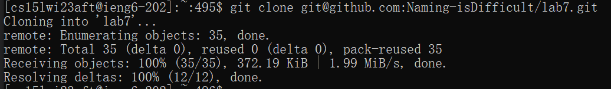
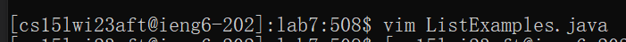

# Week 4 Lab Report

## Step 0: Preparing

Keys pressed: exactly as shown in the picture<br>
Type ```dir``` to check if I have a folder called lab7. Type ```rm -r lab7``` to delete it.<br><br>

Keys pressed: exactly as shown in the picture<br>
In file ```.bashrc```, I've already prepared all what I need for junit tests. However, during the lab, I've found that for some reasons, not only the ```.bashrc``` won't be excuted right after I connect to the remote machine, but also the environmental variables I added before won't be kept, so type ```source ./.bashrc``` to add all environmental variables again.

## Step 1: Clone repo

Keys pressed: the command shown in picture, \<right click><br>
Type ```git clone``` to clone my repo. Use \<right click> to paste what I have in my clipboard.

## Step 2: Run the test

Key Pressed: exactly as shown in the picture<br>
Type ```cd lab7``` to go into the github repo folder. Type ```javac -cp $JUNIT_LIB *.java``` to compile all java files. ```$JUNIT_LIB``` is a envirmental variable I added in step 0. Type ```java -cp $JUNIT_LIB $JUNIT_RUNNER ListExamplesTests``` to run junit tests. ```$JUNIT_RUNNER``` is a envirmental variable I added in step 0.

## Step 3: Debug

Key Pressed: exactly as shown in the picture plus ```i```, \<esc>, and ```:wq``` in vim<br>
Type ```vim ListExamples.java``` to run vim. Press ```i``` to enter editing mode. Press \<esc> to leave editing mode. Type ```:wq``` to save the file and quit.

## Step 4: Re-test

Key Pressed: \<up>\<up>\<up>\<enter>\<up>\<up>\<up>\<enter><br>
```javac -cp $JUNIT_LIB *.java``` is three lines above so press \<up>\<up>\<up>\<enter>. Things are the same for ```java -cp $JUNIT_LIB $JUNIT_RUNNER ListExamplesTests```.

## Step 5: Git push

Key pressed: exactly as shown in the picture<br>
Type ```git add ListExamples.java``` to cache the file we want to push. Type ```git commit -m "Update ListExamples.java"``` to commit. Type ```git push``` to push the cached changes. 