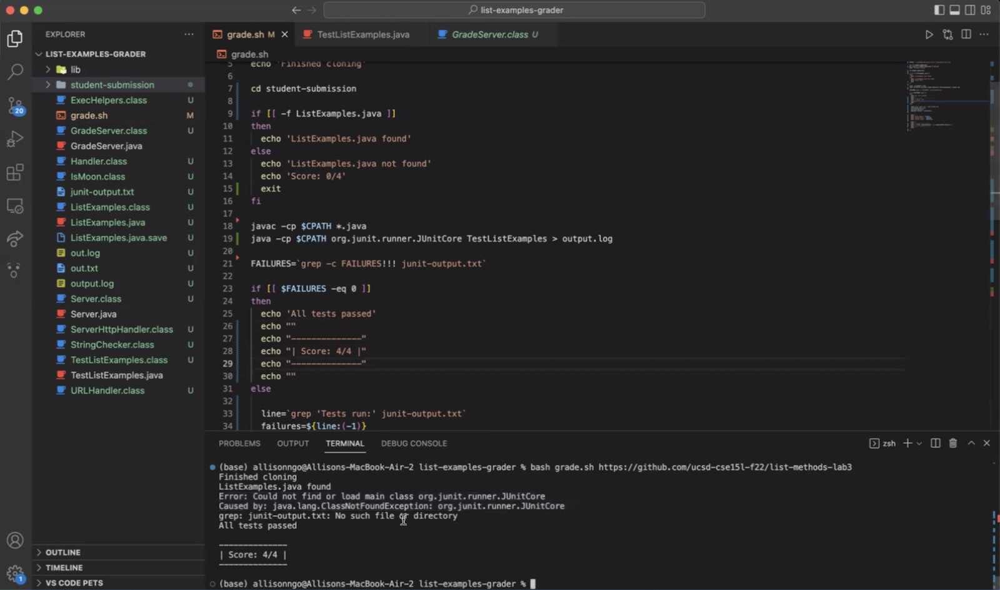

# Lab Report 5
Due to some personal reasons, I missed the last lab. I will try to finish the last lab in this report.

## Scenario 1
<br>
This should be a pretty common error. When running ```Java``` programs with ```java``` command, one should not type any extensions ---- just simply type the class name.<br>
e.g.<br>
```
java -cp $CPATH org.junit.runner.JUnitCore ArrayTests
```
<br>

## Scenario 2
<br>
This one is a little bit hard to tell... What I'm suspecting is that there should be something wrong with ```CPATH```.<br>
It's clear that after line ```cd student-submission```, the script is running under ```student-submission``` directory. Additionally, it's pretty unlikely to have all of the libraries copied into ```student-submission``` directory. In this case, if ```CPATH``` is something like ```./lib/(something).jar:(something else)```, it is likely to cause the same error. However, this explanation cannot explain why it can compile without any error. More information will be needed for this scenario.<br>

## Scenario 3
<br>
I hate this but you will need a space before that 1.<br>
e.g.<br>
```
if [[ 1 -eq $VAR ]]
```
<br>

## Scenario 4
<br>
My favorite part ---- relative path issues. Using absolute path shall always be a safer way to input file path UNLESS you are pretty sure about where you are. <br>
In this specific scenario, the working relative path should be ```../../textfiles/novels/Koko.txt```